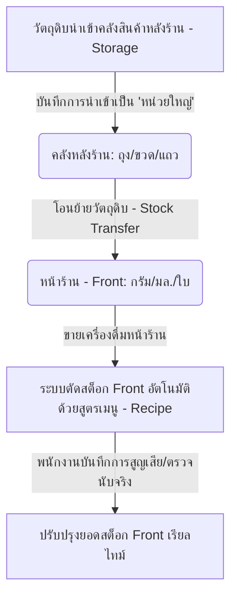
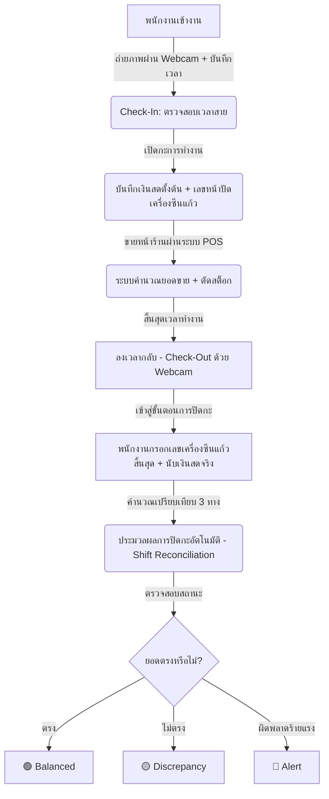

# 🍵 Yencha POS & Shop Operations Management System
> ระบบบริหารจัดการและควบคุมร้านเครื่องดื่มชานมไข่มุกระดับพรีเมียม (Premium POS, Shift Audit & Inventory Tracking System)

ระบบบริหารจัดการร้านชานมไข่มุก **Yencha** ได้รับการออกแบบและพัฒนาขึ้นเพื่อยกระดับการบริหารงานหน้าร้าน (Point of Sale), การควบคุมสต็อกวัตถุดิบ 2 โซนที่แม่นยำ, ระบบบันทึกเวลาเข้างานของพนักงานด้วยเว็บแคมความละเอียดสูง, และระบบตรวจสอบความถูกต้องของกะการทำงาน (Shift Reconciliation) ที่ชาญฉลาด ป้องกันการทุจริตและการรั่วไหลของรายได้อย่างสมบูรณ์แบบ

---

## 📌 สารบัญ (Table of Contents)
1. [🌟 ฟีเจอร์เด่นระดับพรีเมียม (Premium Features)](#-ฟีเจอร์เด่นระดับพรีเมียม-premium-features)
2. [🏗️ สถาปัตยกรรมและเทคโนโลยี (Architecture & Technologies)](#️-สถาปัตยกรรมและเทคโนโลยี-architecture--technologies)
3. [📊 แผนผังการทำงานของระบบ (System Workflows)](#-แผนผังการทำงานของระบบ-system-workflows)
4. [🗄️ โครงสร้างฐานข้อมูล (Database Schema)](#️-โครงสร้างฐานข้อมูล-database-schema)
5. [🚀 ขั้นตอนการติดตั้งและการใช้งาน (Installation & Setup)](#-ขั้นตอนการติดตั้งและการใช้งาน-installation--setup)
6. [💎 รายละเอียดระบบย่อย (Detailed Module Walkthrough)](#-รายละเอียดระบบย่อย-detailed-module-walkthrough)

---

## 🌟 ฟีเจอร์เด่นระดับพรีเมียม (Premium Features)

### 1. ระบบตรวจสอบยอดและปิดกะอัจฉริยะ (Premium Shift Reconciliation)
*   **Three-Way Auditing:** ระบบเปรียบเทียบยอดขาย 3 ทางเพื่อตรวจสอบความผิดพลาดและการรั่วไหล:
    1.  **ยอดเงินจากระบบ POS** (คำนวณจากประวัติการสั่งซื้อจริงในระบบ)
    2.  **ยอดขายจากตัวเลขแก้วที่ถูกซีนจริง** (คำนวณจากเลขเครื่องซีนแก้วเริ่มต้นและสิ้นสุดกะ)
    3.  **เงินสดทางกายภาพ** (Physical Cash Count ที่พนักงานนับได้จริงในลิ้นชัก)
*   **Dynamic Status Tagging:** ระบุสถานะกะทันทีเมื่อปิดกะด้วยป้ายสีที่สวยงามและชัดเจน:
    *   🟢 **Balanced (ยอดตรง):** เงินสดตรงกับระบบและเลขแก้วที่ใช้งานจริง
    *   🟡 **Discrepancy (ยอดไม่ตรง):** มีผลต่างระหว่างระบบ เงินสด หรือจำนวนแก้วที่ใช้งาน
    *   🔴 **Alert (ต้องตรวจสอบด่วน):** มีความคลาดเคลื่อนเกินขีดจำกัดความปลอดภัย
*   **Visual Charts:** แสดงสัดส่วนยอดขายสะสม ยอดขาดดุล และเปรียบเทียบกะย้อนหลังผ่านกราฟวงกลมและกราฟแท่งที่ตอบสนองอย่างรวดเร็ว (Responsive Visualizations)

### 2. ระบบสต็อกสินค้า 2 โซนที่แม่นยำและระบบแจ้งเตือนวัตถุดิบ (Two-Zone Inventory & Visual Analytics)
*   **Two-Zone Stock Control:** แยกส่วนการควบคุมวัตถุดิบออกเป็น 2 โซนอย่างเด็ดขาด:
    *   **Storage (หลังร้าน):** เก็บในรูปแบบบรรจุภัณฑ์ขนาดใหญ่ (ถุง, ลัง, แถวแก้ว)
    *   **Front (หน้าร้าน):** เก็บในหน่วยพร้อมใช้งานจริง (กรัม, มล., ใบ) ป้องกันปัญหาการตัดสต็อกไม่ตรงเมื่อเริ่มเดือนใหม่
*   **Double-Tier Warning Widget:** วิดเจ็ตหน้าแรกและหน้าแดชบอร์ดที่วิเคราะห์สต็อกแบบเรียลไทม์:
    *   ⚠️ **Out of Stock/Critically Low (หมดสต็อก / วิกฤต):** วัตถุดิบที่ต่ำกว่าจุดแจ้งเตือนวิกฤต (แดงเด่นชัด)
    *   💡 **Warning/Low (ใกล้หมด):** วัตถุดิบที่ใกล้ถึงเกณฑ์ต้องเติม (ส้มพาสเทล)
*   **Top Ingredient Usage Widget:** แสดงวัตถุดิบยอดนิยม 5 อันดับแรกที่มีอัตราการใช้งานสูงสุด เพื่อช่วยในการบริหารจัดการคำสั่งซื้อและวิเคราะห์การใช้งานของแต่ละกะ

### 3. ระบบลงเวลาทำงานด้วยเว็บแคมความโปร่งใสสูง (Webcam Attendance Log Viewer)
*   **Photo Stamp Logging:** พนักงานทุกคนต้องถ่ายภาพยืนยันตัวตนผ่านกล้องเว็บแคมหน้าร้านในขณะที่ทำการลงเวลาเข้างาน (Check-In) และออกงาน (Check-Out)
*   **Premium Attendance Control Center:**
    *   แสดงรายการข้อมูลการเข้า-ออกงานในรูปแบบการ์ดพรีเมียม (Glassmorphism Cards)
    *   ระบบตรวจสอบพนักงานที่มาสาย (Late Detection) และพนักงานที่ยังไม่ลงเวลากลับ (Active Status Indicators)
    *   การแสดงรูปภาพถ่ายตัวจริงของพนักงานเมื่อวางเมาส์เหนือรูปภาพ (Interactive Magnifier Modals)

---

## 🏗️ สถาปัตยกรรมและเทคโนโลยี (Architecture & Technologies)

ระบบพัฒนาขึ้นโดยอิงมาตรฐาน Modern Monolithic Architecture มีประสิทธิภาพสูง ปลอดภัย และมีอัตราการตอบสนองที่รวดเร็ว:

*   **Backend Stack:** PHP 8+ (รองรับ PHP 8.2 ขึ้นไปอย่างสมบูรณ์), การประมวลผลคำสั่งฐานข้อมูลแบบปลอดภัยสูงด้วย **PDO MySQL** เพื่อป้องกัน SQL Injection
*   **Database:** MariaDB / MySQL 5.7+ (ใช้ระบบโครงสร้าง `enterpr_porsystem.sql` และใช้ Table Prefix `yencha_`)
*   **Frontend Technologies:**
    *   **Core UI:** HTML5, CSS3, JavaScript (ES6+), Bootstrap 4 (Custom Layout)
    *   **Interactive Components:** jQuery, SweetAlert2 (หน้าต่างแจ้งเตือนพรีเมียม), Toastr Notifications
    *   **Data Representation:** Chart.js (กราฟยอดขายและการปิดกะ)
    *   **Camera API:** WebcamJS 1.0.26 (ถ่ายรูปพนักงานฝั่ง Client-Side)

---

## 📊 แผนผังการทำงานของระบบ (System Workflows)

### 1. ระบบควบคุมสต็อก 2 โซน (Two-Zone Inventory Flow)


### 2. ขั้นตอนการทำงานในการเข้างานและการตรวจสอบกะ (Shift Reconciliation & Attendance Flow)


---

## 🗄️ โครงสร้างฐานข้อมูล (Database Schema)

ตารางหลักในระบบ Yencha (ใช้ฐานข้อมูล `enterpr_porsystem`):

| ชื่อตาราง (Table Name) | บทบาทและรายละเอียดข้อมูล (Role & Description) |
| :--- | :--- |
| `yencha_ingredients` | ข้อมูลวัตถุดิบ (หน่วยนับ, สต็อกหน้าร้าน `front_qty`, สต็อกหลังร้าน `storage_qty`, จุดแจ้งเตือน `alert_limit`, `critical_limit`) |
| `yencha_shifts` | บันทึกประวัติการเปิด-ปิดกะการทำงาน (ยอดเงินเข้าระบบ, ยอดนับจริง, เลขเครื่องซีนแก้วเริ่มต้น/สิ้นสุด, เงินสดขาด/เกิน) |
| `yencha_attendance` | บันทึกการเข้า-ออกงานของพนักงาน (ชื่อพนักงาน, เวลาเข้า-ออก, ชื่อไฟล์รูปภาพจากการถ่าย Webcam, สถานะล่าช้า) |
| `yencha_inventory_audits` | บันทึกการตรวจสอบยอดความต่างของวัตถุดิบที่สูญหายจากการนับจริง เทียบกับยอดที่ควรมีในระบบ |
| `yencha_stock_transfers` | บันทึกประวัติการโอนย้ายวัตถุดิบจากคลังสินค้าหลังร้าน (Storage) ไปยังหน้าร้าน (Front) |
| `yencha_audit_logs` | ล็อกการทำงานเพื่อความปลอดภัย (User, การกระทำ, รายละเอียด, วันเวลา) |

---

## 🚀 ขั้นตอนการติดตั้งและการใช้งาน (Installation & Setup)

### 📋 สิ่งที่ต้องเตรียม (Prerequisites)
1.  ติดตั้งโปรแกรมจำลองเซิร์ฟเวอร์ เช่น **XAMPP** หรือ **Laragon** (รองรับ PHP 8.0 - 8.2 ขึ้นไป)
2.  เปิดใช้งานเซอร์วิส **Apache Web Server** และ **MySQL Database Server**
3.  เปิดกล้องเว็บแคมในเว็บเบราว์เซอร์เพื่อใช้งานระบบบันทึกเวลาถ่ายรูปพนักงาน

### 💻 ขั้นตอนการติดตั้ง (Setup Steps)
1.  คัดลอกโฟลเดอร์โครงการไปไว้ในไดเรกทอรีเว็บไซต์ของคุณ (เช่น `C:\xampp\htdocs\jn\`)
2.  สร้างฐานข้อมูลใหม่ชื่อ `enterpr_porsystem` ในระบบจัดการฐานข้อมูล (เช่น phpMyAdmin หรือ MySQL Workbench)
3.  นำเข้าไฟล์ฐานข้อมูล `enterpr_porsystem.sql` (ซึ่งอยู่ที่รากของโครงการ) เข้าไปในฐานข้อมูลที่สร้างขึ้น
4.  ตรวจสอบการตั้งค่าการเชื่อมต่อฐานข้อมูลในไฟล์ `connectDB.php` ให้ถูกต้อง:
    ```php
    <?php
    $host = "localhost";
    $db_name = "enterpr_porsystem";
    $username = "root"; // เปลี่ยนตามจริง
    $password = "";     // เปลี่ยนตามจริง
    // ...
    ```
5.  เปิดเว็บบราวเซอร์แล้วเข้าไปที่ `http://localhost/jn/login.php` หรือ `http://localhost/jn/yencha/` เพื่อเริ่มใช้งาน

---

## 💎 รายละเอียดระบบย่อย (Detailed Module Walkthrough)

### 📊 หน้าแรกและหน้าแดชบอร์ดหลัก (`index.php`, `dashboard.php`)
เป็นศูนย์กลางการแสดงสถานะและการดำเนินงานทั้งหมดของร้าน มีการตกแต่งด้วยโทนสีหรูหรา สไตล์พาสเทลและมินิมอล มีวิดเจ็ตแสดงผลเรียลไทม์:
*   **ระบบสต็อก 2 โซน:** แจ้งเตือนแบบ 2 ระดับด้วยบัตรสีแดง (หมดสต็อก) และสีส้ม (ระดับต่ำ) ทันที
*   **วิดเจ็ตยอดนิยม:** การจัดอันดับวัตถุดิบที่มีอัตราการใช้งานสูงสุด 5 อันดับแรก แสดงข้อมูลเป็นเปอร์เซ็นต์และแถบพลังที่สวยงาม

### 💵 ระบบจัดการกะและเปรียบเทียบยอดขาย (`reconciliations.php`, `close_shift_db.php`)
หน้าจอพรีเมียมสำหรับเจ้าของร้านและผู้จัดการเพื่อสืบค้นข้อมูลกะที่ปิดตัวลงไปแล้ว:
*   **ตารางข้อมูลกะ:** มีตัวกรองวันเริ่มต้นและสิ้นสุด พร้อมค้นหาตามสถานะการจับคู่ยอด (Balanced, Discrepancy, Alert)
*   **ระบบคำนวณเงินสด:** เปรียบเทียบ `เงินสดรวมในระบบ` vs `เงินสดทางกายภาพที่นับได้` และแสดงตัวเลขส่วนต่างพร้อมสีสัญญาณเตือน
*   **ตรวจสอบฝั่งเครื่องซีนแก้ว:** เปรียบเทียบผลต่างระหว่างแก้วที่ถูกซีนจริงจากเลขเครื่องซีนเริ่มต้น-สิ้นสุด เทียบกับยอดขายรายการสั่งซื้อในระบบ

### 📷 แผงตรวจสอบการลงเวลาทำงานด้วยเว็บแคม (`attendance_list.php`)
หน้าจอสำหรับฝ่ายบุคคลหรือผู้จัดการเพื่อตรวจสอบพนักงาน:
*   **Webcam Photo:** บันทึกภาพพนักงานเป็นไฟล์ JPG บันทึกไว้ในโฟลเดอร์ `uploads/` โดยตั้งชื่อตามเวลาและประเภท (CheckIn/CheckOut)
*   **Interactive List:** สามารถกรองดูตามชื่อพนักงาน ค้นหา และดูเวลาทำงานรวม (ชั่วโมงทำงาน) ในแต่ละวันได้อย่างละเอียด พร้อมแสดงรูปภาพถ่ายจริงของพนักงานเพื่อความโปร่งใส

---
*พัฒนาร่วมกันและส่งมอบความพรีเมียมโดย Antigravity AI Coding Assistant 🍵*
